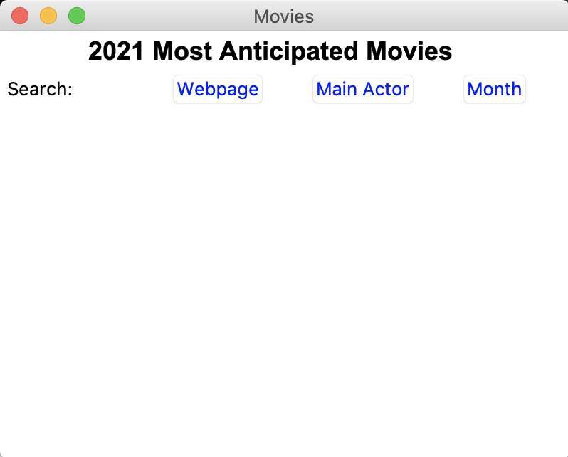
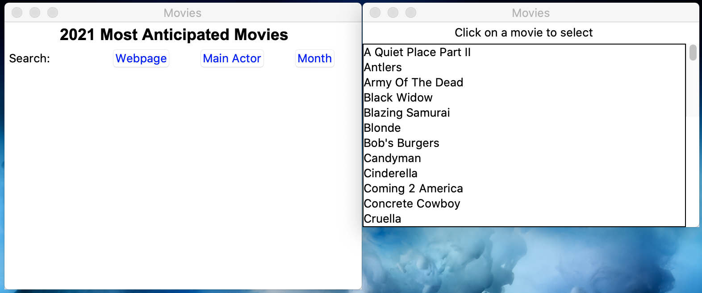
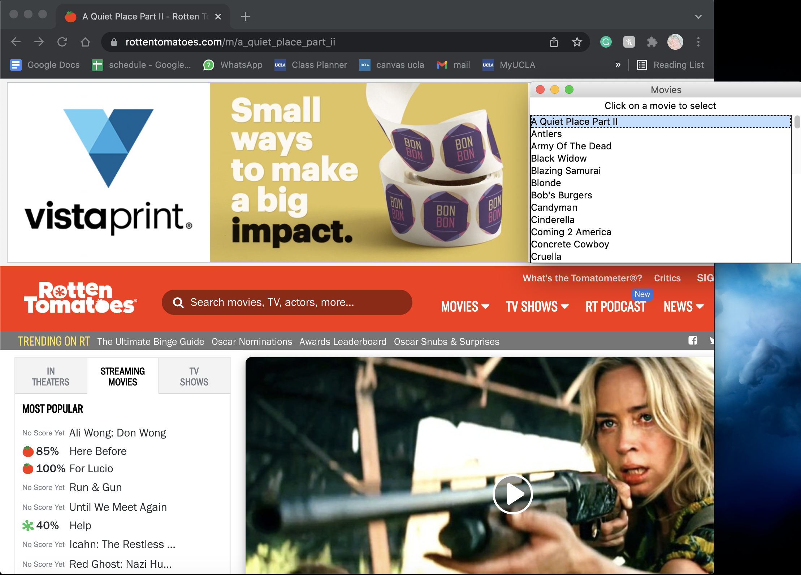
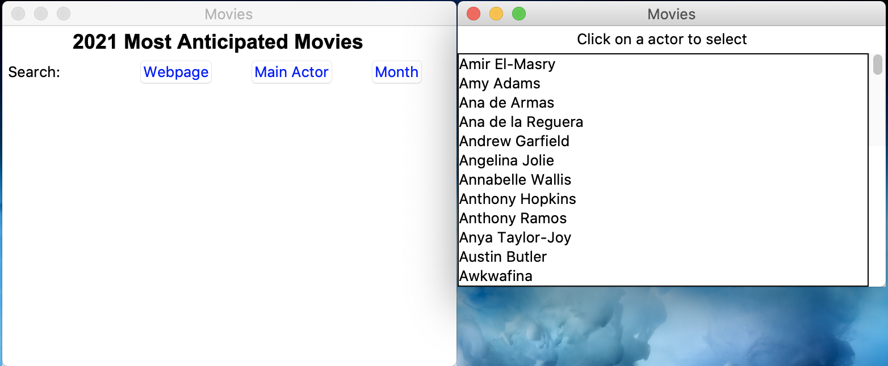
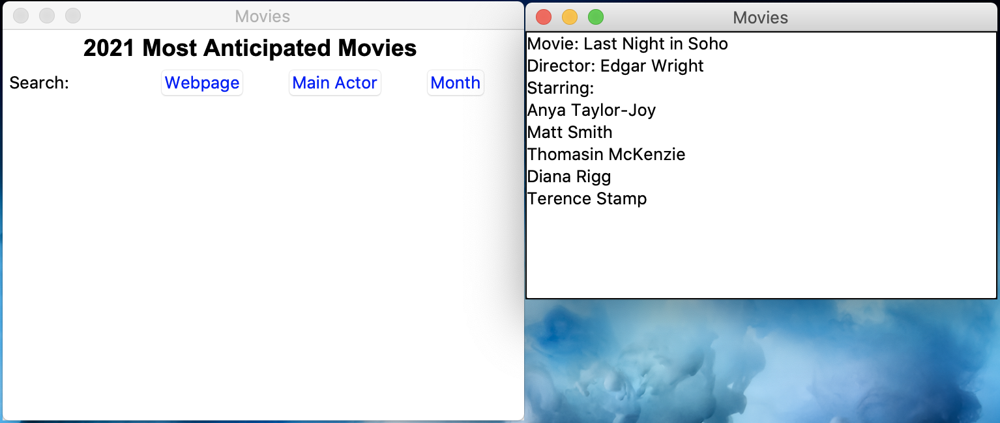
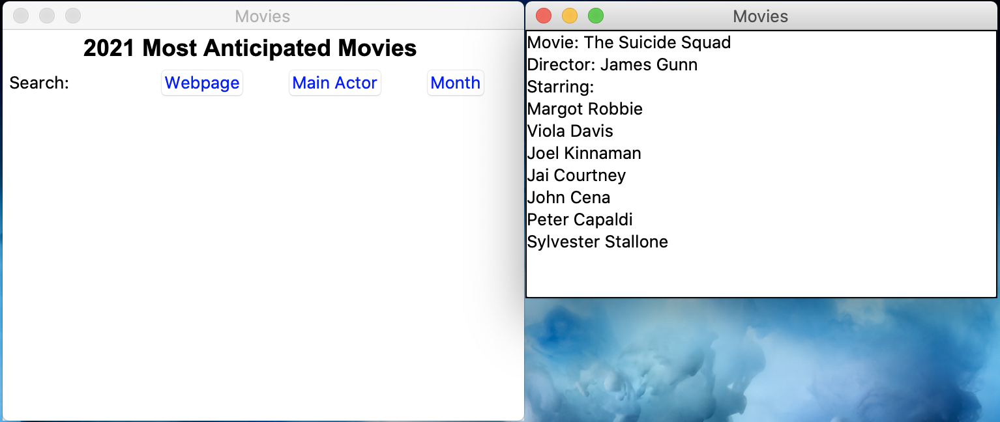

# Movie Search and Display Manager 
Source data: Rotten Tomatoes Most Anticipated Movies of 2021

## Back-end

This back-end of this program traverses through a website, "https://editorial.rottentomatoes.com/article/most-anticipated-movies-of-2021/", 
and used BeautifulSoup and requests to obtain data points of movies listed in the website. Data is then created into a SQL database and .json file. The processing of this website from its HTML code is cumbersome, hence the many if statements in the backend processing of this website into data structure. However, they are a way to navigate through inconsistency with the website's HTML counterpart despite the neat display. 

Feautures used in the back-end:
- requests, BeautifulSoup is used to get the webpage's content (using a parser and class specification)
- Data is read in and stored in a collections default dictionary to more easily add in new data points
- Data is then dumped into a JSON file
- Data is also created into an SQL database, limitations are made (i.e. taking the first 11 main actors).
  - MoviesDB, a table, would consist of the title, url, month, director, and a set of 11 actors 
  - MonthsDB, a table, would consist of the month of release and the title of the movie

## Front-end

The front-end of this program interacts with the user with three windows: a display, dialog, and main window.

Feautures used in the front-end:
- When a long list of choices is presented to a user (Re: list of movies in the Webpage window, actors' name, and months of the year), a tkinter Listbox and Scrollbar for users to comfortably skim through their choices. 
- tkinter is used to manage the different windows in an orderly display:
  - A display window is used to manage ways to display multiple/one movie showing the: Movie name, Director, and Main Actors starring in the show
  - A dialog window is used to manage the SQL database made and display according to the user choice from the main window, described in detail below
  - A main window is used to manage all windows, calling on the dialog and display window according to the user clicks and establishing tkinter Buttons, Labels, Title and Grids for the user interface.

## A visualization of the program!

It's initial page is meant for users to choose through three choices:

From the main window, users are able to:
- Choose from all movies available through the 'Webpage' search:
  
  - Users will be directed to a webpage in Rotten Tomatoes of such movie
  
- Select their favorite actors and find their films, alphabetically 
  
  - Users will be directed to a list of the actors' works of 2021 (e.g. Anya Taylor Joy)
  
- Select a month from 2021 and be shown films released from that month
  
  - Users will be directed to a list of movies released that month (e.g. August!)
  

When users close the displays, they would be brought back to the main window. 
